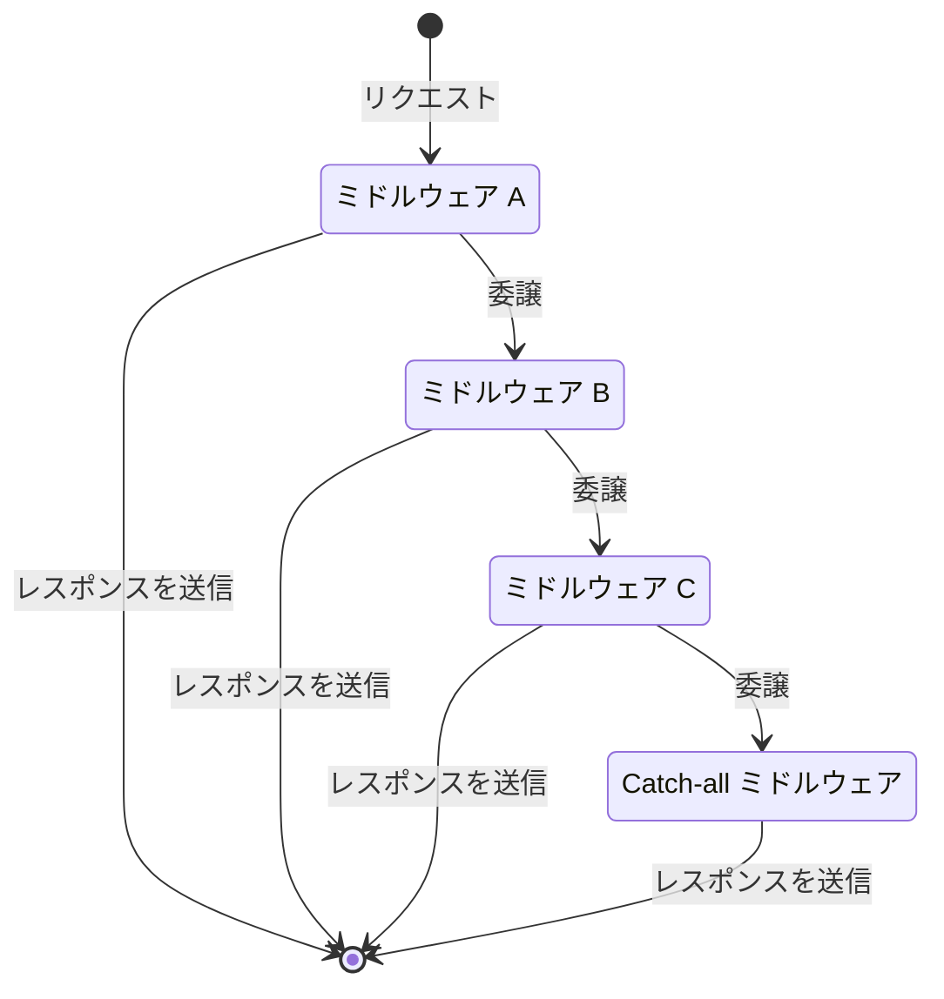

# 開発サーバー

::: tip 🎯 このページのゴール

- Viteの開発サーバーのがリクエストを処理する仕組みを理解しましょう
  :::

Viteの開発サーバーは、一般的なWebサーバーと同様に、特定のURLに対するリクエストを受け取り、特定のリソースを返します。

どんなURLへのリクエストに対してどんなリソースを返すかは、Webサーバーの実装次第です。たとえば、 `/index.html` というURLに対するリクエストに、Webサーバーのファイルシステムにおける `/index.html` を返す必要はありません。かわりに `/www/index.html` ファイルを返すことが可能です。また、 `/src/main.ts` というURLに対するリクエストに、URLの見た目から推測されるとおりにTypeScriptのコードを返す必要もありません。

::: info 💡 ポイント
URL (Uniform Resource Locator) とは、インターネット上の固有のリソースのアドレスであって、そのアドレスに実際に何があるかをあらわしたものではないことに留意してください。
:::

なお、リクエストに対応する処理を決定するのはURLだけでなく、リクエストのその他の属性（例：HTTPヘッダー）も考慮して決定される場合もあります。

リクエストにまつわる諸条件にもとづき、Viteの開発サーバーは、さまざまなリクエストに対してさまざまな処理をおこないます。

## ミドルウェア

リクエストを引数として受け取り、特定の処理をおこなう関数を「ミドルウェア」といいます。Viteでは、[connect](https://www.npmjs.com/package/connect)というサーバーフレームワークを利用してミドルウェアの登録と実行ををおこないます。たとえば、以下のようなリクエストとミドルウェアの関係が定義されています。

| リソース     | URL例            | ミドルウェア            | ファイルシステム上で対応するファイル |
| :----------- | :--------------- | :---------------------- | :----------------------------------- |
| `index.html` | `/index.html`    | `indexHtmlMiddleware`   | `/index.html`                        |
| JavaScript   | `/src/main.ts`   | `transformMiddleware`   | `/src/main.ts`                       |
| CSS          | `/src/style.css` | `transformMiddleware`   | `/src/style.css`                     |
| 静的ファイル | `/favicon.ico`   | `servePublicMiddleware` | `/public/favicon.ico`                |

::: info 💡 ポイント
実際は、「ファイルシステム上で対応するファイル」の各パスには、Viteの開発サーバーが起動しているディレクトリまでのパスが先頭についています。
:::

Viteの開発サーバーに登録されるミドルウェアは、登録された順に、リクエストを引数として受け取り以下の処理をおこないます。

- リクエストを処理すべきか判定する
- 処理すべき場合、特定の処理をおこない、レスポンスを返す
- 処理すべきでない場合、次のミドルウェアに処理を委譲する

これらミドルウェアによる一連の処理は、「早期に終了可能なパイプライン」として捉えることができます。



実際のViteの開発サーバーには、このページで紹介した３つのミドルウェア以外のミドルウェアも登録されていますが、「判定・処理・委譲」という考え方で実装されている点は同じです。

::: info 💡 ポイント
なお、Viteの場合はあてはまりませんが、ミドルウェアは、特定の処理をおこなったあとにレスポンスを返す必要は必ずしもありません。副作用を起こしたのち、次のミドルウェアに処理を移譲する場合もあります（例：ロギング、リクエストの変更）。
:::

## ☕ コラム「Viteの開発サーバーの内部実装を読み取る」

ここで、以下のようなプロジェクト構成を考えてみましょう。

```
.
├── index.html
├── public/
│   ├── index.html
│   └── src/
│       └── main.js
└── src/
    └── main.js
```

そして、各ファイルのコードを以下とします。

- `/index.html`

  ```html
  <!doctype html>
  <html lang="en">
    <body>
      <h1>/index.html</h1>
      <script type="module" src="/src/main.js"></script>
    </body>
  </html>
  ```

- `/public/index.html`

  ```html
  <!doctype html>
  <html lang="en">
    <body>
      <h1>/public/index.html</h1>
      <script type="module" src="/src/main.js"></script>
    </body>
  </html>
  ```

- `/public/src/main.js`

  ```js
  console.log('/public/src/main.js')
  ```

- `/src/main.js`

  ```js
  console.log('/src/main.js')
  ```

このとき、Viteの開発サーバーを起動して `/` にアクセスすると、 `/index.html` が画面に表示され、ブラウザのコンソールには `/public/src/main.js` と表示されます。一方で、 `/index.html` にアクセスすると、 `/public/index.html` が画面に表示されますが、ブラウザのコンソールには変わらず `/public/src/main.js` と表示されます。

このことから、以下のようなViteの開発サーバーの内部実装が読み取れます。

1. `servePublicMiddleware` は `/` で始まるパスが、 `/public` ディレクトリ配下のファイルのパスと一致する場合、そのファイルを返す
1. `servePublicMiddleware` は `transformMiddleware` よりも先に登録（実行）されている
1. `/` へのリクエストは、 上記の条件を満たさない（`"/" !== "/index.html"`）ため、　`/public/index.html` は返されない
1. `/index.html` へのリクエストには `/public/index.html` が返されているため、 `servePublicMiddleware` は `indexHtmlMiddleware` よりも先に登録（実行）されている

---

::: info ✨ まとめ

- Viteの開発サーバーは、一般的なWebサーバーと同じ原理で動いています
- Viteの開発サーバーは、リクエストをミドルウェアのパイプラインによって処理します
- 各ミドルウェアは、特定のリクエストだけを処理し、処理しない場合は後続のミドルウェアに処理を委譲します
  :::
